# DSNxBCT_LLM_Agent

LLM-powered User Modeling & Review Generation and Recommendation System for the DSN × BCT Data & AI Hackathon 3.0.

---

# 🧠 Overview

This project builds a **user-aware LLM agent system** that learns from Yelp-style data and generates:

- ⭐ Personalized rating predictions  
- ✍🏾 Realistic review text generation  
- 👤 User behavior modeling  
- 🎯 Personalized recommendations
- 🌐 FastAPI-based inference service  

It uses **local LLM inference via Ollama** to ensure offline, low-cost deployment.

---

## 📁 Project Structure
```text
project/
├── app.py
├── api/                  # FastAPI routes
├── assets/               # Demo screenshots and presentation visuals
├── data/                 # Raw + processed data + embeddings
├── models/               # Rating, ranking, review & behavior models
├── rag/                  # Response generation (RAG pipeline)
├── recommender/          # Recommendation engine
├── retrieval/            # FAISS + embedding search
├── training/             # Model training scripts
├── evaluation/           # Evaluation metrics & scoring
├── prompts/              # LLM prompts
├── utils/                # Helper utilities
├── Dockerfile
├── docker-compose.yml
└── requirements.txt
```
---

## 🏗️ Architecture Diagram
```text
                +-------------------+
                | Yelp Dataset      |
                +-------------------+
                          |
                          v
                +-------------------+
                | Data Processing   |
                +-------------------+
                          |
          +---------------+---------------+
          |                               |
          v                               v
+-------------------+       +----------------------+
| User Profiling    |       | Embedding + FAISS    |
+-------------------+       +----------------------+
          |                               |
          +---------------+---------------+
                          |
                          v
                +-------------------+
                | LLM Agent Layer   |
                | (Ollama)          |
                +-------------------+
                          |
          +---------------+---------------+
          |                               |
          v                               v
+-------------------+       +----------------------+
| Review Generator  |       | Recommendation API   |
+-------------------+       +----------------------+
                          |
                          v
                +-------------------+
                | FastAPI Service   |
                +-------------------+
```

---

# 🚀 Key Features

## 👤 User Modeling
Learns user behavior from historical reviews:

- Average rating behavior
- Favorite business categories
- Reviewer style classification:
  - strict reviewer
  - balanced reviewer
  - lenient reviewer

---

## ⭐ Review Generation (Task A)

Given:
- `user_id`
- `business_id`

The system:
- Predicts rating (1–5)
- Generates realistic review text
- Adapts tone based on user personality

---

## 🎯 Recommendation System (Task B)

Given:
- `query`
- `user_id`

The system:
- Recommends relevant businesses
- Personalizes results based on user preferences
- Ranks recommendations by relevance

---

## 🌐 API Service (FastAPI)

Fully container-ready REST API for evaluation and demo purposes.

---

# 🔄 System Pipeline
```text
Yelp Dataset (Raw JSON)
        ↓
Data Processing Layer (process_data.py)
        ↓
Processed Data (CSV + embeddings)
        ↓
User Profiling Engine (user_profile.py)
        ↓
LLM Review Generator (review_generator.py, Ollama)
        ↓
Recommendation Engine (recommender.py)
        ↓
FastAPI Service Layer (app.py)
```

---

# 📊 Dataset

**Yelp Open Dataset** (real-world business reviews and user interactions):

- review.json
- business.json
- user.json

Processed into:
```text
data/processed/
├── reviews.csv
├── businesses.csv
└── users.csv
```
---

## ⚙️ Tech Stack

- 🐍 Python
- ⚡ FastAPI
- 🤖 Ollama (LLM)
- 🔍 FAISS
- 🧠 Pandas, NumPy
- 📊 Scikit-learn
- 🐳 Docker
- 🗄️ JSON / CSV

---

## 📋 Prerequisites
- Python 3.10+
- Docker
- Ollama
- Ubuntu 22.04+
- 8GB RAM recommended

---

## ⚙️ Full Setup Guide (Manual Deployment)

### Step 1: Clone Repository
```bash
git clone https://github.com/Take-Off-7/DSNxBCT_LLM_Agent
cd DSNxBCT_LLM_Agent/project
```

### Step 2: Install Ollama
```bash
curl -fsSL https://ollama.com/install.sh | sh
```

### Step 3: Start Ollama Server
```bash
ollama serve
```
Ollama runs by default at:
http://localhost:11434

### Step 4: Pull Required Model
Open a NEW terminal:
```bash
ollama pull llama3.2:1b
```

### Step 5: Pull and Run API Docker Container
Open another terminal:
```bash
docker pull takeoff7/llm-agent:latest
docker run --network=host -e OLLAMA_URL=http://localhost:11434/api/generate takeoff7/llm-agent:latest
```

---

## 🔌 API Access & Endpoints

After setup, open your browser and navigate to:

http://localhost:8000

Then append `/docs` to access the OpenAPI Swagger UI:

http://localhost:8000/docs

| Endpoint | Method | Description |
| :--- | :--- | :--- |
| `/` | GET | Confirm API is running properly |
| `/samples` | GET | Supply sample IDs for quick testing  |
| `/profile` | POST | Build and fetch user profile |
| `/review` | POST | Generate simulated review for a user and business |
| `/recommend` | POST | Return personalized ranked recommendations |
| `/llm-status` | GET | Health check and  Ollama connection status |

---

## 🧪 Testing & Usage Guide

### 🔹 Testing User Profile (`POST /profile`)

- Call `/samples` to get a valid `user_id`
- Provide the selected `user_id` in the request body
- Send request:

```json
{
  "user_id": "lcp3WgYyYRfcqewpilwmyg"
}
```

### 🔹 Testing Review Generation (`POST /review`)

- Call `/samples` to get valid `user_id` and `business_id`
- Provide both IDs in the request body
- Send request:

```json
{
  "user_id": "FJf1k333aqmmMaMTv-CFNA",
  "business_id": "G6lbDeRY_ZpD7FS5dL3qJw"
}
```

### 🔹 Testing Recommendations (`POST /recommend`)
- Call `/samples` to get valid `user_id`  
- Provide a query along with the `user_id`
- Send request:

```json
{
  "query": "recommend a coffee shop",
  "user_id": "lcp3WgYyYRfcqewpilwmyg"
}
```

---

## 📸 Demo

### Swagger API
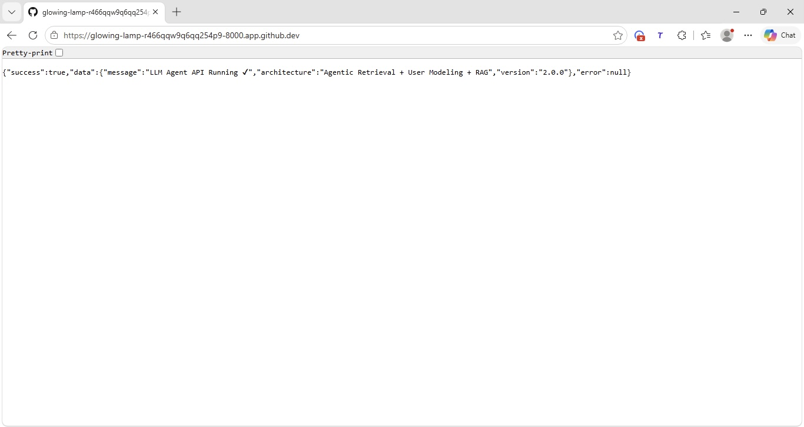
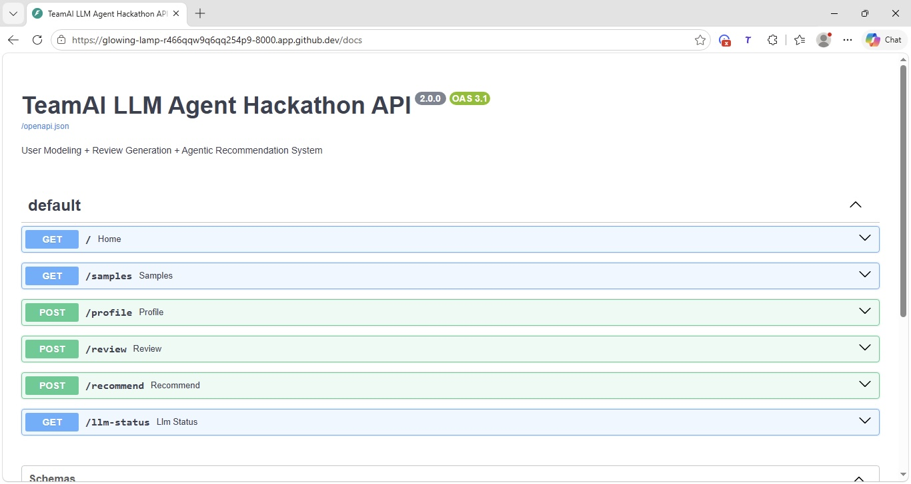

### Home
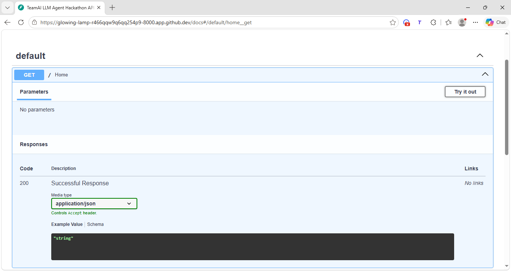
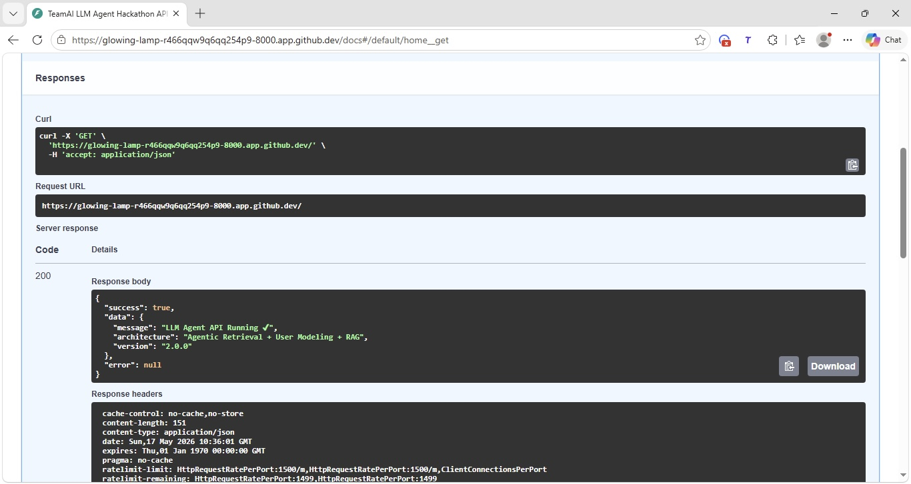

### User Profile
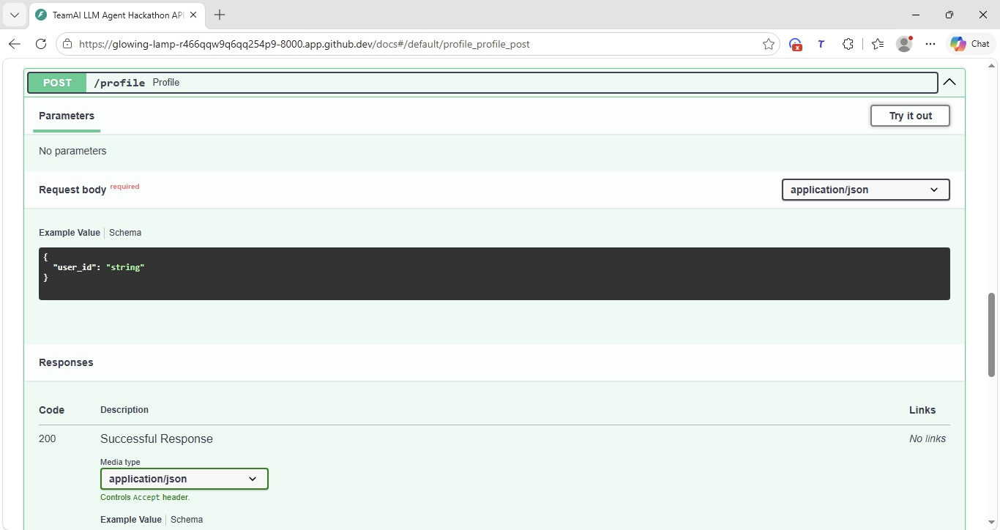
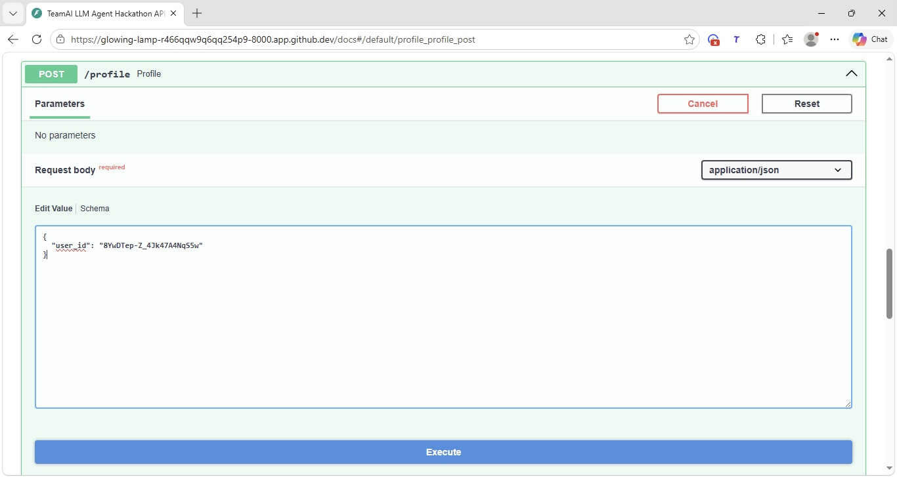


### Review Generation

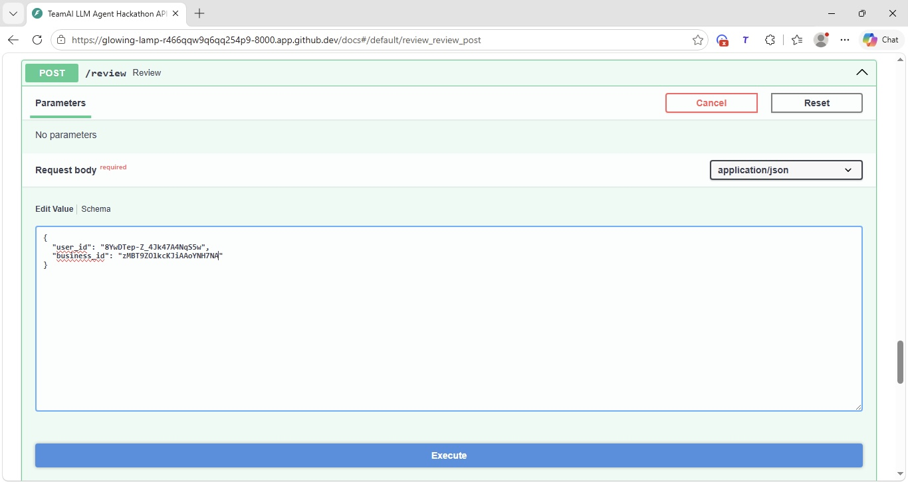
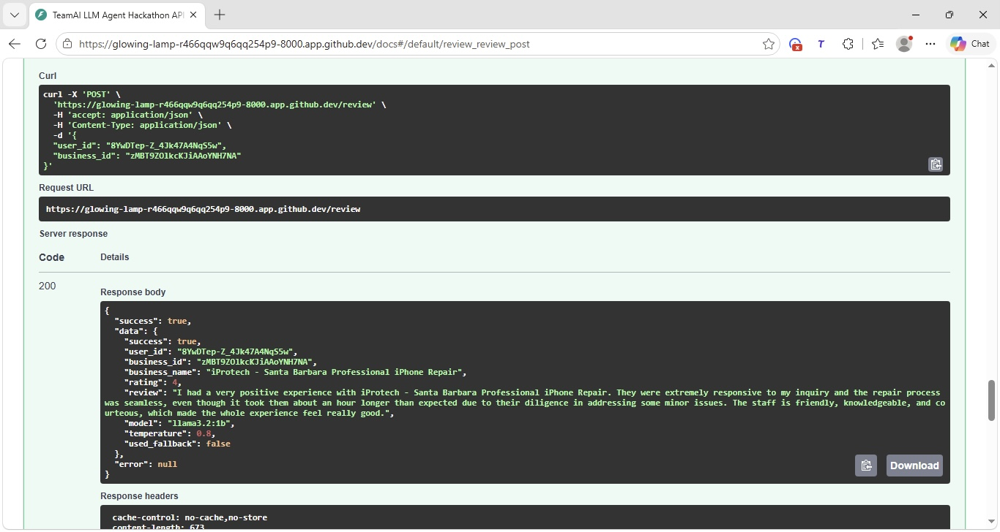

### Recommendation
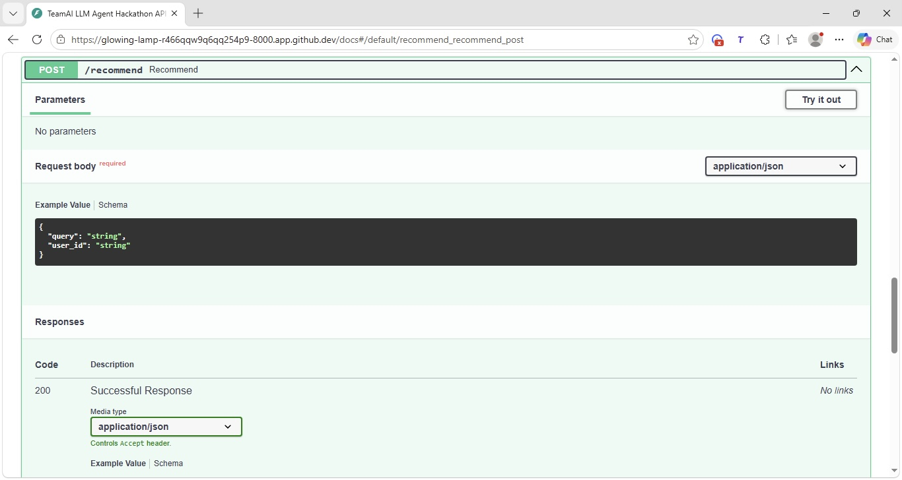
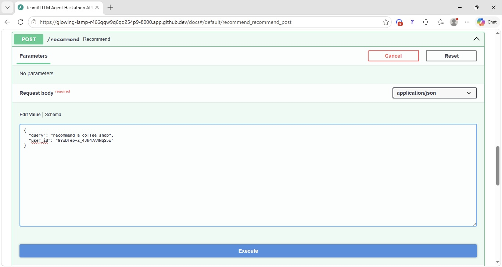
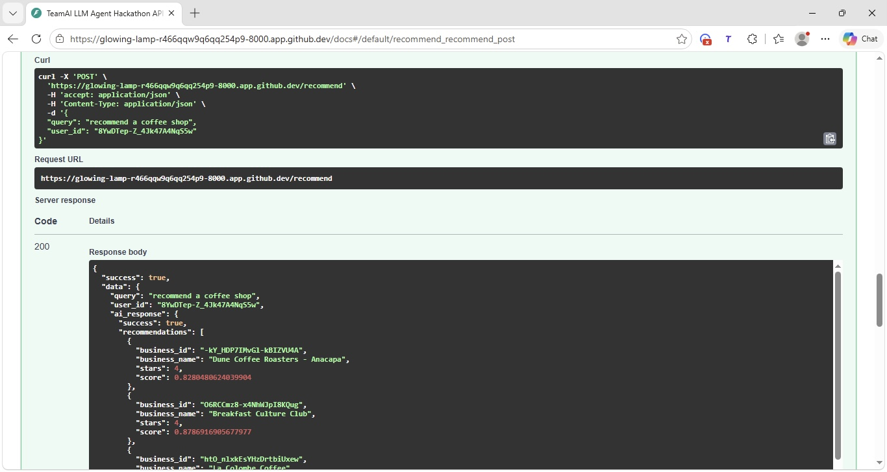

### LLM-Status
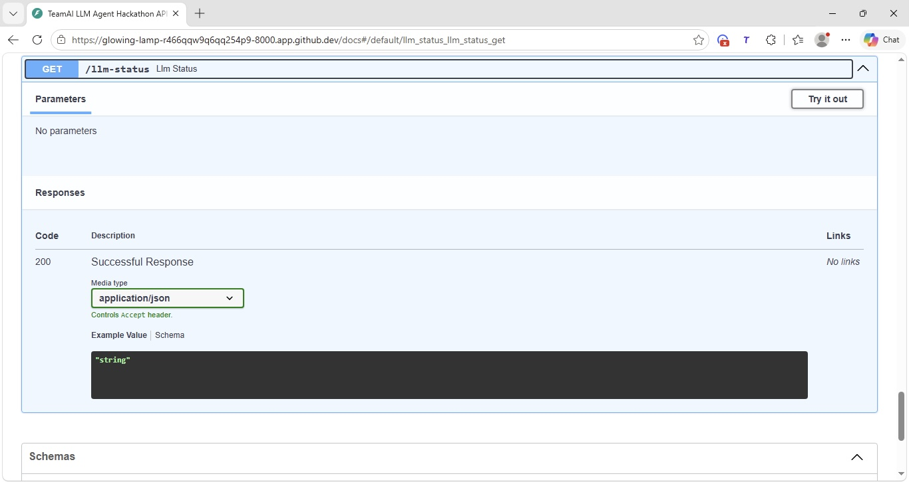
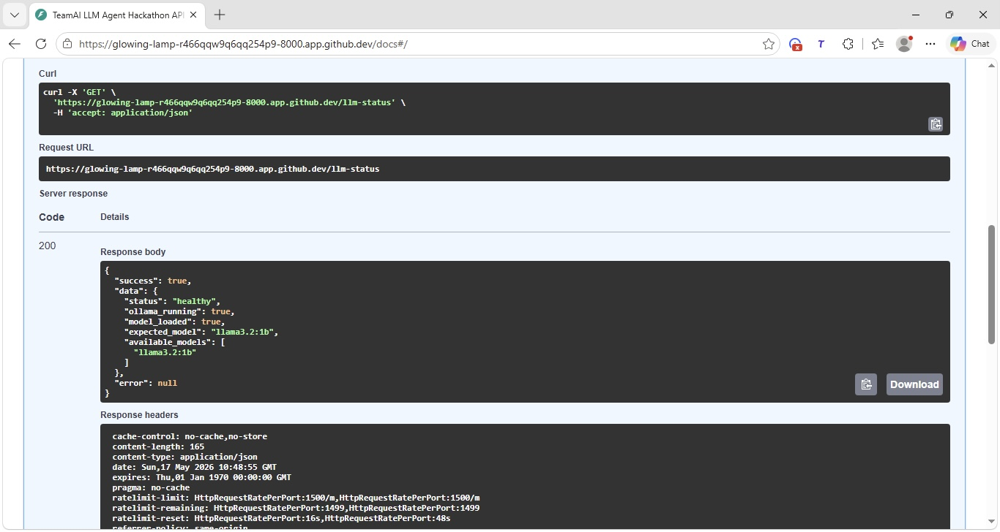

---

## 🚀 Future Work

- Multi-modal recommendations
- Fine-tuned review generation
- Real-time user adaptation
- Hybrid retrieval + graph recommendation
- Streaming LLM responses

---

## 👥 Contributors

- Fakeye Taiwo
- Fakeye Kehinde
- Bamigbade Babatunde
- Godwin Chidera

---

## 📄 License

MIT License

---

## 🙏 Acknowledgements
We would like to thank the following organizations, tools, platforms, and open-source communities that made this project possible:
- **Bluechip Technologies** and **Data Science Nigeria (DSN)**  — for organizing the **DSN x BCT LLM Agent Challenge** and providing the opportunity to build and showcase innovative AI solutions.
- **Yelp Open Dataset** — for providing large-scale real-world business, review, and user interaction data used for training and evaluation.
- **Ollama** — for enabling efficient local LLM inference and offline deployment capabilities.
- **FAISS** — for fast and scalable vector similarity search used in semantic retrieval.
- **FastAPI** — for powering the lightweight and high-performance API service layer.
- **Scikit-learn, Pandas, and NumPy** — for machine learning utilities, data processing, and numerical computation.
- The broader **open-source AI community** for tools, research, and resources that inspired and supported this project.
